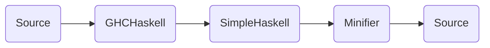

# simple-haskell-minifier

This project implements a transpiler to minify a simple subset of the Haskell language.




## Overview and scope

The project is composed of three modules:

- [GHCHaskell](src/GHCHaskell.hs): parses and decodes Haskell source with [ghc-lib-parser][ghc-lib-parser].
- [SimpleHaskell](src/SimpleHaskell.hs): defines a simple Expr data type.
- [Minifier](src/Minifier.hs): transforms and renders the Expr.

The Minifier does the following transformation:

- [x] Combine repeated names when possible.
- [x] Rename binder to single letter name.
- [x] Inline single-use variable.
- [x] Remove unused space.
- [ ] Pack the lines to fit a column limit.


## Usage

```ShellSession
$ cabal run << EOF
module Demo where

render 0 = putStrLn "game-over"
render score
    | score >= 1, score <= 2 = pure ()
    | otherwise = putStrLn ("score: " ++ show score)
eval pos | pos > 42 = True
         | otherwise = False

EOF
```
```haskell
a 0=d"game-over";
a e|e>=1,e<=2=pure()|c=d("score: "++show e);
b e|e>42=True|c=False;
c=True;
d=putStrLn
```

Checkout the [examples](examples) for more minification demos.


## Contribute

Contributions and bug reports are welcome!
The implementation works ok for the examples, and I'd be happy to integrate changes to support other usage.

To work on this project you need a Haskell toolchain: [get-started](https://www.haskell.org/get-started/).
Run the `./bin/run-tests` script to validate a commit.

[ghc-lib-parser]: https://hackage.haskell.org/package/ghc-lib-parser
